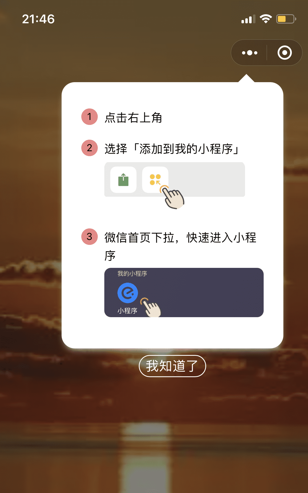
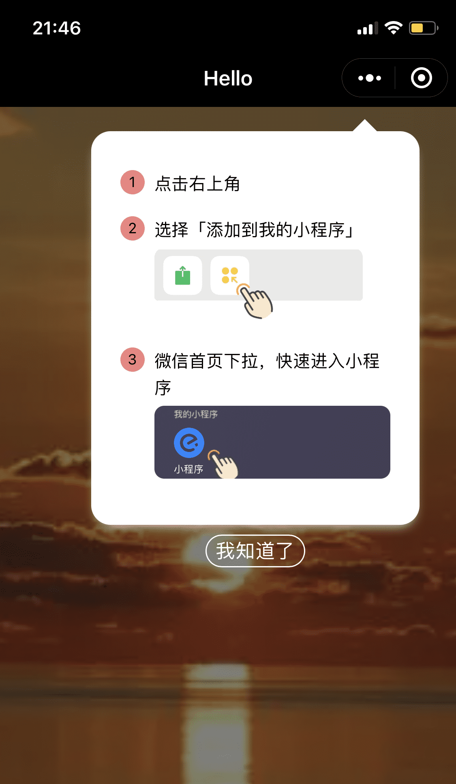

# pin-prompt

微信小程序中，提示用户点击左上角按钮，添加到我的小程序。






### 安装

#### npm

```
npm i --save wx-pin-prompt
```

然后，在微信开发者工具中执行「编译 npm 」

#### 直接下载源码

直接下载源码，添加到你的项目中

### 使用

在页面 json 文件中添加组件
``` json
"pin-prompt": "/path/to/wx-pin-prompt/pin-prompt/pin-prompt"
```

在 wxml 文件中

```
<!-- 自动在第一进入时，展示添加提示框，之后不再显示 -->
<pin-prompt auto name="我的小程序" logo="../pathtoyourlogo.png"></pin-prompt> 

<!-- 展示带有详细引导步骤的提示框 -->
<pin-prompt show type="card" name="我的小程序" logo="../pathtoyourlogo.png"></pin-prompt> 

<!-- 如果页面使用了自定义的导航栏 -->
<pin-prompt show customNavbar name="我的小程序" logo="../pathtoyourlogo.png"></pin-prompt> 
```


### 参数

| 属性       | 默认值                           | 说明                                                      |
| ---------- | -------------------------------- | --------------------------------------------------------- |
| text       | 点击「添加小程序」，方便下次访问 | 提示语                                                    |
| type       | bar                              | 【提示框类型】bar：长条型，点击会展示 card 型；card：卡片型（含详细引导步骤） |
| background | \#fff (白色)                   | 提示框背景色                                              |
| customNavbar | false                             | 页面是否使用自定义的导航栏，用于自动定位提示框              |
| auto       | false                            | 如果为 true，则自动在第一次打开时提示，之后不在展示       |
| duration   | 5                                | 展示时长。之后自动隐藏                                    |
| logo       | 无                               | 用于详细引导步骤中，展示自家小程序 logo                   |
| name       | 无                               | 用于详细引导步骤中，展示自家小程序名称                    |
| show       | false                            | 展示提示框                                                |
| showDetail | false                            | 展示详细步骤提示框                                        |

