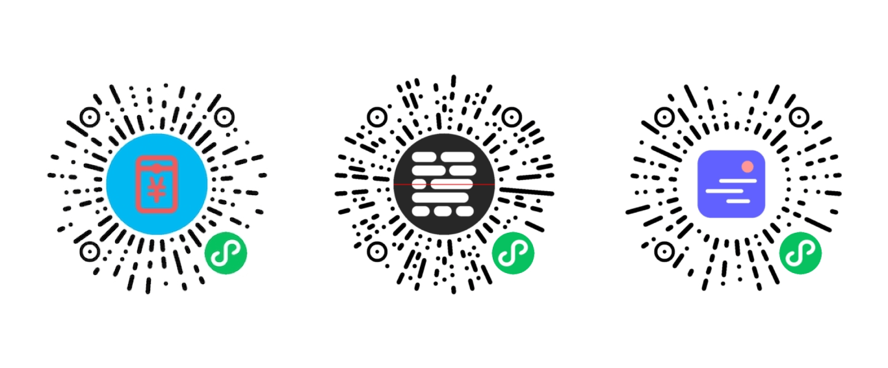

# pin-prompt “添加到我的小程序”提示框

微信小程序中，提示用户点击右上角按钮，**添加到我的小程序**。

* 长条状无干扰方式展示

* 卡片状带详细引导步骤展示

* 支持自定义导航栏

* 支持横竖屏

* 支持自动提示

  

### 扫码体验


### 示例


### 安装

#### 方式一：npm

```
npm i --save wx-pin-prompt
```

然后，在微信开发者工具中执行 **「构建 npm 」**

#### 方式二：直接下载源码

直接下载源码，添加到你的项目中


### 使用

在页面 json 文件 `usingComponents` 中添加组件
``` json
"pin-prompt": "/miniprogram_npm/wx-pin-prompt/pin-prompt"
```

在 wxml 文件中

```html
<!-- 自动在第一次进入时，展示添加提示框，之后不再显示 -->
<pin-prompt auto delay="{{3}}" name="我的小程序" logo="../pathtoyourlogo.png"></pin-prompt> 

<!-- 展示带有详细引导步骤的提示框 -->
<pin-prompt show type="card" name="我的小程序" logo="../pathtoyourlogo.png"></pin-prompt> 

<!-- 如果页面使用了自定义的导航栏 -->
<pin-prompt show customNavbar name="我的小程序" logo="../pathtoyourlogo.png"></pin-prompt> 
```


> ⚠️注意：通过 npm 安装，可能会遇到在开发者工具报错 “渲染层网络层错误” 。可忽略。在真机上可以正常运行。


### 参数

| 属性       | 默认值                           | 说明                                                      |
| ---------- | -------------------------------- | --------------------------------------------------------- |
| text       | 点击「添加小程序」，方便下次访问 | 提示语                                                    |
| type       | bar                              | 【提示框类型】bar：长条型，点击会展示 card 型；card：卡片型（含详细引导步骤） |
| background | \#fff (白色)                     | 提示框背景色                                              |
| customNavbar | false                          | 页面是否使用自定义的导航栏，用于自动定位提示框              |
| auto       | false                            | 如果为 true，则自动在第一次打开时提示，之后不在展示       |
| delay      | 0                                | 延迟展示的时间（秒）。默认不延迟       |
| duration   | 5                                | 展示时长（秒）。之后自动隐藏。0 代表不自动隐藏                              |
| logo       | 无                               | 用于详细引导步骤中，展示自家小程序 logo                   |
| name       | 无                               | 用于详细引导步骤中，展示自家小程序名称                    |
| show       | false                            | 展示提示框                                                |
| showDetail | false                            | 展示 card 型提示框                                        |

